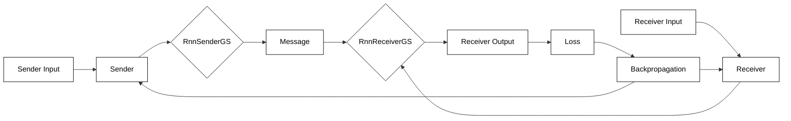

### A Unified Modeling Language (UML) flowchart of the model architecture using Mermaid, a diagramming and charting tool. Click on the open preview icon to see it.

```mermaid
%%{init: {'theme': 'default'}}%%
graph LR
    A[Sender Input] --> B[Sender]
    B --> C{RnnSenderGS}
    C --> D[Message]
    D --> E{RnnReceiverGS}
    F[Receiver Input] --> G[Receiver]
    G --> E
    E --> H[Receiver Output]
    H --> I[Loss]
    I --> J[Backpropagation]
    J --> B
    J --> G

    style A fill:#fff,stroke:#000,color:#000
    style B fill:#fff,stroke:#000,color:#000
    style C fill:#fff,stroke:#000,color:#000
    style D fill:#fff,stroke:#000,color:#000
    style E fill:#fff,stroke:#000,color:#000
    style F fill:#fff,stroke:#000,color:#000
    style G fill:#fff,stroke:#000,color:#000
    style H fill:#fff,stroke:#000,color:#000
    style I fill:#fff,stroke:#000,color:#000
    style J fill:#fff,stroke:#000,color:#000
```